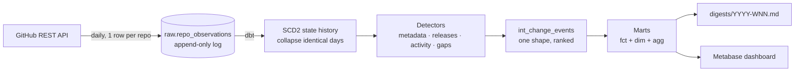
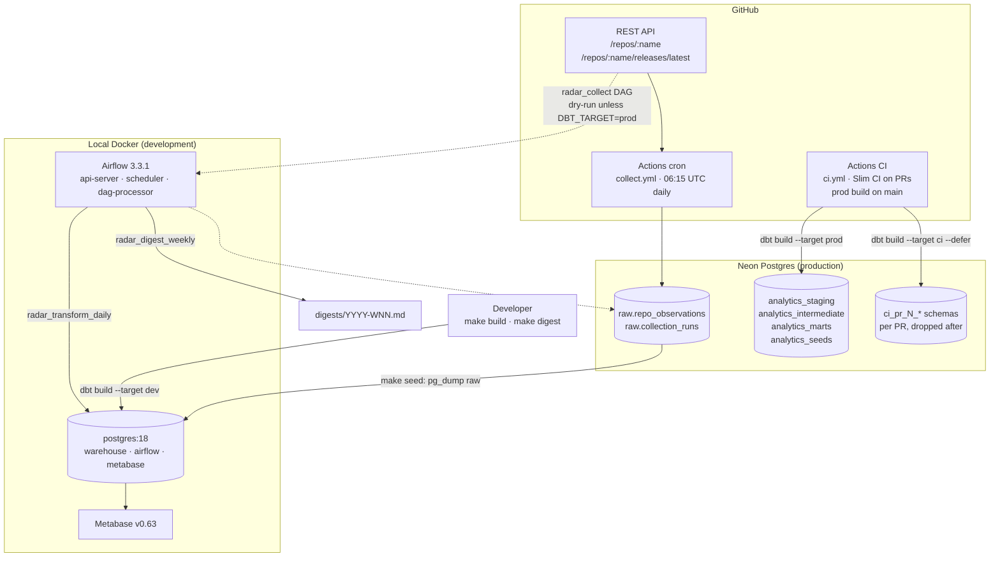
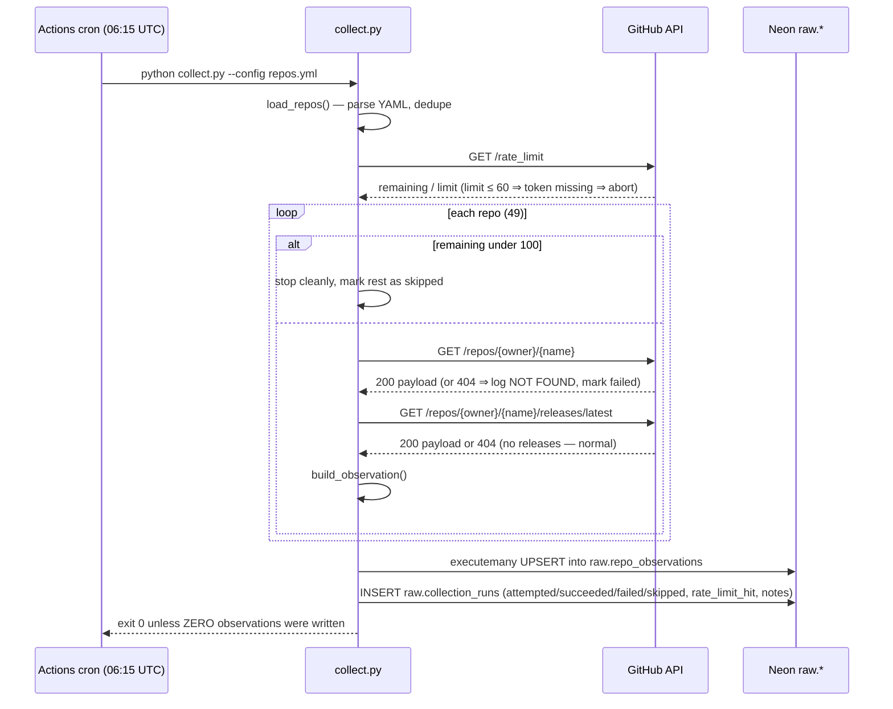
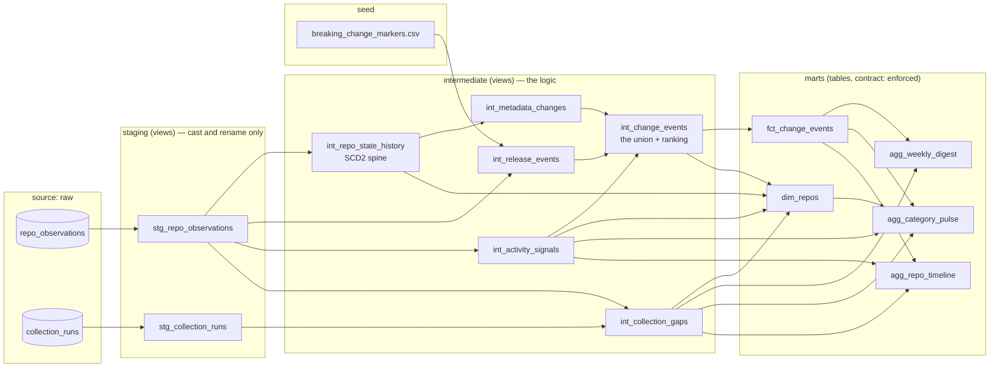
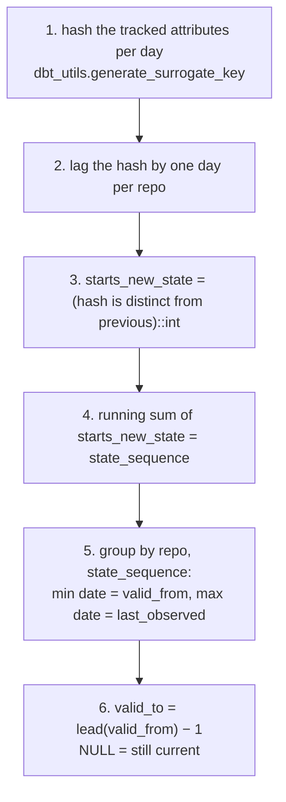
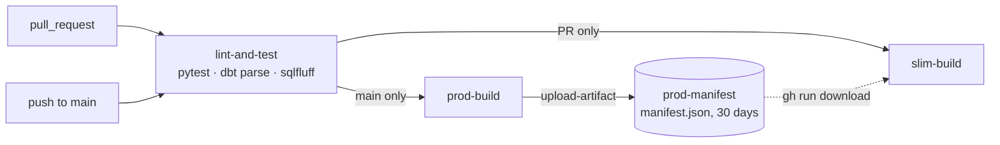
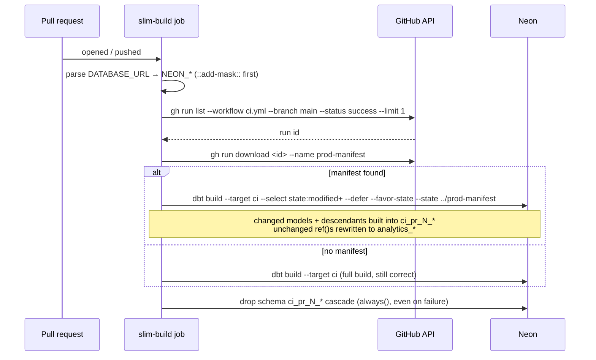
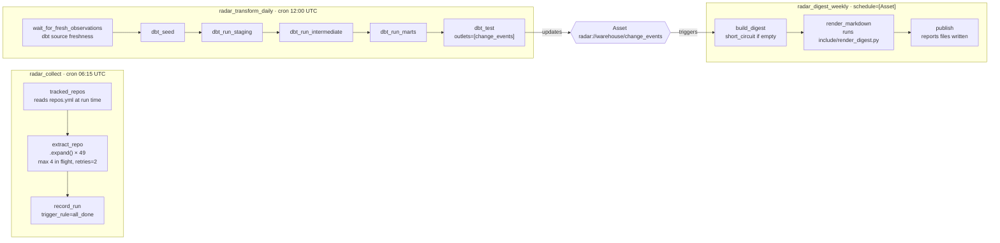

# oss-radar — The Handbook

A complete explanation of the project for someone taking it over, or for
someone who has to defend every decision in it. It covers what each piece
does, how the pieces connect, why each was chosen, what was rejected, and
what will bite you. `DESIGN.md` remains the design authority; this document
explains the design as built, on 2026-09-12.

---

## Table of contents

1. [What the project is](#1-what-the-project-is)
2. [The mental model in one minute](#2-the-mental-model-in-one-minute)
3. [Architecture and data flow](#3-architecture-and-data-flow)
4. [Environments, databases and ports](#4-environments-databases-and-ports)
5. [Phase 0 — the collector](#5-phase-0--the-collector)
6. [Phase 1 — the dbt warehouse](#6-phase-1--the-dbt-warehouse)
7. [Change types, materiality and ranking](#7-change-types-materiality-and-ranking)
8. [Testing](#8-testing)
9. [CI — Slim CI and the production build](#9-ci--slim-ci-and-the-production-build)
10. [Phase 2 — Airflow](#10-phase-2--airflow)
11. [Outputs — the digest and the dashboard](#11-outputs--the-digest-and-the-dashboard)
12. [Developer workflow](#12-developer-workflow)
13. [Decision log — what was chosen and what was rejected](#13-decision-log--what-was-chosen-and-what-was-rejected)
14. [Failure scenarios](#14-failure-scenarios)
15. [Known limitations](#15-known-limitations)
16. [Things that already bit us](#16-things-that-already-bit-us)
17. [Security incident: the leaked Neon password](#17-security-incident-the-leaked-neon-password)
18. [Status and what is left](#18-status-and-what-is-left)
19. [Glossary](#19-glossary)
20. [Self-test questions](#20-self-test-questions)

---

## 1. What the project is

The AI tooling ecosystem ships new repositories constantly — coding agents,
MCP servers, skills and plugin collections, eval harnesses, orchestration
frameworks, model-serving engines. Watching fifty of them on GitHub produces
five hundred notifications and no signal.

`oss-radar` tracks a categorised set of 49 GitHub repositories, observes them
once a day, detects **material** changes, ranks them, and emits a weekly
digest answering one question: *what changed this week that I actually need
to know about.*

Material means things like: a repo was **archived**, its **licence changed**,
it was **renamed or transferred**, it shipped a **major or breaking release**,
or it **went stale**. A patch release is recorded but ranked low.

### Why not just GitHub notifications

Every reviewer thinks this within ten seconds, so the README answers it on
its first screen. Two reasons:

1. **Ranking by materiality.** GitHub notifies per repo, and a repo being
   archived arrives exactly the same way as a patch release. This aggregates
   across an ecosystem and orders by how much the change matters.
2. **Queryable history.** GitHub gives you a feed. This gives you a
   warehouse. "Which MCP repos changed licence last year?" and "which projects
   went stale?" are questions a notification feed cannot answer at all.

If the project could not answer those better than a feed, the design says to
re-scope rather than ship.

### Non-goals

- Not a security scanner (OpenSSF Scorecard exists).
- Not a package registry mirror.
- No GH Archive firehose — that turns this into a volume exercise.
- No LLM summarisation in v1.
- No automated repo discovery in v1.

---

## 2. The mental model in one minute



Everything downstream of the observation log is a **pure function of the
log**. Drop the warehouse and rebuild it and you get the identical result.
That single property justifies most of the design: the log is the only thing
that must never stop, and it is the only thing that cannot be recreated.

The three ideas to hold on to:

- **Observe, don't snapshot.** Store what GitHub said every day. Derive change
  from that later. Never depend on a process having run at the right moment.
- **Identity is the numeric repo id.** Names change; ids do not. A rename is
  an attribute change on one repo, not one repo dying and another appearing.
- **Every reported change carries evidence.** If a reader cannot verify a
  digest line without opening GitHub, the line has no value over a
  notification.

---

## 3. Architecture and data flow



### The four write paths into the observation log

| Path | Where it runs | Writes to Neon? | Purpose |
|---|---|---|---|
| `collect.yml` cron | GitHub Actions, daily 06:15 UTC | Yes | **The** production collector. Must never stop. |
| `radar_collect` DAG | Local Airflow | Only if `DBT_TARGET=prod` or triggered with `{"dry_run": false}` | Same code, mapped into 49 tasks; the fallback path and the "mapped task" demonstration. |
| `make collect` | Developer host | Yes, after a 5-second abort window | Manual run, rarely used. |
| `make collect-dry` | Developer host | No | Verify `repos.yml` before trusting it. |

Both real paths upsert on `(repo_full_name, observed_date)`, so running both
on the same day is harmless: the later run overwrites with identical data.

### Read paths

- **dbt dev** reads the local `warehouse` database, which `make seed` fills
  from a `pg_dump` of Neon's `raw` schema. Read-only against Neon.
- **dbt prod / ci** read Neon's `raw` directly and build into `analytics_*` or
  `ci_pr_N_*`.
- **The renderer and the dashboard** read marts — local by default.

---

## 4. Environments, databases and ports

### Two Postgres instances, deliberately

| | Neon (production) | Local Docker (development) |
|---|---|---|
| Version | Postgres 18.6 | `postgres:18` image, tracking the major tag |
| Holds | `raw.*` (observation history), `analytics_*` (prod marts), `ci_pr_*` (transient) | `warehouse` (dev copy of raw + `dbt_tapan_*` schemas), `airflow` (Airflow metadata), `metabase` (Metabase app DB) |
| Written by | Collector (cron), CI prod build, CI slim build | `make seed`, `make build`, Airflow, Metabase |
| Cold start | Scales to zero when idle; first connection takes seconds — `connect_timeout=30` everywhere | Always on while the container runs |

**Why the local image is `postgres:18`, not 16:** `pg_dump` refuses to dump a
server newer than itself. A pg16 client cannot seed from Neon 18 at all.
`scripts/seed_dev.sh` preflights this and tells you which tag to bump to if
Neon moves major.

**Why three databases in one local container:** Airflow's metadata DB must
never be the same database as the warehouse dbt builds into — pointing dbt at
Airflow's metadata is a real, miserable mistake. Metabase's app DB follows the
same rule. `init/01-airflow-db.sql` and `init/03-metabase-db.sql` create them
on first boot of an empty volume; `make metabase-up` also creates `metabase`
if the volume predates that file.

### dbt targets (`dbt_project/profiles.yml`, in-repo, no `~/.dbt`)

| Target | Host | Schema prefix | Used by |
|---|---|---|---|
| `dev` | `RADAR_PG_HOST:RADAR_PG_PORT` (host: `localhost:5433`; inside Airflow: `postgres:5432`) | `dbt_tapan` → `dbt_tapan_staging`, `dbt_tapan_intermediate`, `dbt_tapan_marts`, `dbt_tapan_seeds` | `make build`, local Airflow |
| `prod` | Neon via `NEON_*` env | `analytics` → `analytics_staging` … | CI on push to `main` |
| `ci` | Neon via `NEON_*` env | `DBT_CI_SCHEMA` (`ci_pr_<N>`) → `ci_pr_12_staging` … | CI on pull requests |

The `dev` target reads host and port from environment variables so the same
target works from two vantage points: the host sees the container as
`localhost:5433`; a container on the compose network sees it as
`postgres:5432`. docker-compose sets the override for Airflow.

### Ports and env

| Service | Host port | Variable |
|---|---|---|
| Postgres | 5433 | `RADAR_PG_PORT` (5433 so a native Postgres on 5432 does not collide) |
| Airflow | 8081 | `RADAR_AIRFLOW_PORT` (8080 is taken by `dbt docs serve`) |
| Metabase | 3000 | `RADAR_METABASE_PORT` |
| dbt docs | 8080 | `make docs` |

`.env` (gitignored, quoted values) holds `GH_TOKEN`, `DATABASE_URL`,
`NEON_*`, ports and the Metabase admin login. **Values must be quoted**:
`DATABASE_URL` contains an `&`, and unquoted, a shell `source` backgrounds the
assignment and silently loses the variable. The Makefile deliberately does not
`include .env` (Make does not strip quotes); every recipe sources it through
bash instead.

---

## 5. Phase 0 — the collector

Lives in `collector/`. A plain Python script on a GitHub Actions cron. No
Airflow, no dbt. It has been running since 2026-09-09 and must not be
interrupted, because **history only accumulates in real time** — GitHub will
not tell you what a repo's licence was three weeks ago.

### Flow



### The schema (`collector/schema.sql`)

**`raw.repo_observations`** — one row per repo per calendar day.

- Identity + config from `repos.yml`: `repo_full_name` (the **requested**
  path, not what the API returned), `category`, `priority`.
- Collection metadata: `observed_at`, `observed_date`, `collector_version`.
- Extracted repo fields: `stars`, `forks`, `open_issues`, `subscribers`,
  `license_spdx`, `is_archived`, `is_disabled`, `is_fork`, `default_branch`,
  `description`, `homepage`, `topics[]`, `primary_language`, `size_kb`,
  `repo_created_at`, `repo_pushed_at`, `repo_updated_at`.
- Latest release fields: tag, name, published_at, is_prerelease, body,
  body sha256.
- **Full API payloads as `jsonb`**: `raw_repo_payload`, `raw_release_payload`.
- `unique (repo_full_name, observed_date)` — the upsert key.

**`raw.collection_runs`** — one row per collector invocation: started/finished
timestamps, counts attempted/succeeded/failed/skipped, `rate_limit_hit`,
`rate_limit_remaining`, free-text `notes`.

### Design decisions

| Decision | Why | Alternative rejected |
|---|---|---|
| **Append-only observation log** | History is complete and recomputable from. Volume is ~30 MB/year. | A current-state table — loses history; a dbt snapshot — only captures change from when it first runs and a missed run loses a change forever. |
| **Full payloads as `jsonb`** | Re-collecting the past is impossible. A field needed in two months is already there. `github_repo_id` was later pulled out of the payload without a collector change — exactly this scenario. | Store only extracted fields — cheaper, but any new field starts its history at zero. |
| **Upsert on `(repo, day)`** | Re-running on the same day corrects rather than duplicates. Idempotency established at the source. | Plain insert with dedup downstream — pushes the problem into every consumer. |
| **Store the requested name, not the returned one** | `repos.yml` stays a stable join key even after a repo moves. The returned name is in the payload as `api_full_name`, and the two differing *is* the rename signal. | Store the returned name — a rename would break the join to config. |
| **Partial success is success** | If the budget runs low, stop cleanly, record skips in `collection_runs`, exit 0. Only zero observations fails the workflow. | Fail on any error — a single flaky repo would alert daily and hide real failures. |
| **`collection_runs` exists** | A gap is a recorded fact, not something discovered months later by noticing absent dates. Feeds `int_collection_gaps`. | Infer gaps from missing rows only — cannot distinguish "cron died" from "repo skipped". |
| **Rate-limit floor of 100** | Leaves headroom and avoids GitHub's *secondary* limits, which are enforced separately from the 5,000/hour budget. | Drain to zero — trips secondary throttling and fails mid-run. |
| **`psycopg` v3, not `psycopg2`** | Python 3.13; `psycopg2-binary` wheels are unreliable there. v3's `executemany` pipelines automatically on Postgres 14+. | `psycopg2` — dbt-postgres pulls it internally, which is fine; our code does not import it. |
| **Cron at :15, not :00** | Top of the hour is the busiest slot on shared runners; scheduled jobs get queued or dropped there. | |

### The GitHub client (`GitHubClient`)

Minimal and deliberate: three calls, bounded retries.

- 200 → return JSON. 404 with `allow_404` → `None` (renamed/deleted/private,
  or simply no releases).
- 403 with `X-RateLimit-Remaining: 0` → `RateLimitExhausted`, stop the whole
  run, no retry.
- 403/429 otherwise → secondary limit: sleep `Retry-After` if present, else
  `min(60, 2^attempt)`, retry up to 4 times.
- 5xx → sleep `min(30, 2^attempt)`, retry.
- `check_budget()` aborts loudly if `limit ≤ 60` — that means the token was
  not applied and you are unauthenticated.

### `repos.yml`

The only file to edit to add or remove a tracked repo. 49 repos across
`coding-agents` (10), `mcp-servers` (11), `orchestration` (8),
`eval-harnesses` (7), `model-serving` (6), `skills-and-plugins` (5),
`unclassified` (2); 10 are `priority: high`. Verify with `make collect-dry`
before trusting a new entry — a renamed path may resolve silently via
GitHub's redirect, and that difference becomes a `renamed_or_transferred`
event.

---

## 6. Phase 1 — the dbt warehouse

dbt Core 1.12.4, dbt-postgres 1.11.0, `dbt_utils` package. Thirteen models in
three layers, one seed, two macro files.

### Lineage



### Layer conventions (non-negotiable)

| Layer | Prefix | Materialisation | Rule |
|---|---|---|---|
| staging | `stg_` | view | Cast, rename, unpack. No logic, no filtering, no dedup — hiding a source violation here would mask a collector bug the source test exists to catch. |
| intermediate | `int_` | view | The real logic. Never exposed to consumers. |
| marts | `dim_` / `fct_` / `agg_` | table | Consumable. `contract: enforced` on every one. Grain stated as the first line of the description. |

Every model has a `.yml` entry with a description and at least one test. A
model with no description does not get merged.

### Model by model

#### `stg_repo_observations`
Grain: one row per repo per day (unchanged from source). Three things to
understand here:

- **Three identities**, deliberately separate. `github_repo_id` =
  `(raw_repo_payload->>'id')::bigint`, stable across renames, and the key
  everything downstream partitions on. `repo_full_name` = what `repos.yml`
  asked for. `api_full_name` = what the API returned. The last two differing
  is the rename signal.
- **`topics` normalised to a sorted comma-separated string.** GitHub does not
  guarantee topic order, so hashing the raw array would start a new state
  period whenever the same topics came back reordered. Also, dbt unit tests
  cannot cast a Postgres array type, so an array column would make every
  downstream unit test unrunnable.
- Payloads are carried through but not unpacked — that belongs in
  intermediate, where there is a reason to reach in.

#### `stg_collection_runs`
Adds `run_date` (UTC date of `started_at`), `is_incomplete` (`finished_at is
null` — died mid-flight), `is_partial` (any failed or skipped).

#### `int_repo_state_history` — the SCD2 spine
Grain: one row per repo per distinct **state period**, with `valid_from` /
`valid_to`. Everything else depends on it.

How it works, step by step:



A worked example, one repo:

| observed_date | licence | hash | new? | state_seq |
|---|---|---|---|---|
| 09-09 | MIT | h1 | 1 (lag is NULL) | 1 |
| 09-10 | MIT | h1 | 0 | 1 |
| 09-11 | Apache-2.0 | h2 | 1 | 2 |
| 09-12 | Apache-2.0 | h2 | 0 | 2 |

Collapses to two rows: `[09-09, 09-10]` MIT and `[09-11, NULL]` Apache-2.0.

Decisions embedded in it:

- **Tracked attributes:** `api_full_name`, `license_spdx`, `is_archived`,
  `is_disabled`, `is_fork`, `default_branch`, `description`, `homepage`,
  `primary_language`, `category`, `priority`, `topics`.
- **Excluded on purpose:** volatile counts (`stars`, `forks`, `open_issues`,
  `subscribers`) — they change daily and would make the spine a verbose copy
  of the log; they are handled as velocity in `int_activity_signals`. Release
  fields — handled by `int_release_events`, which has to parse semver anyway.
- **`generate_surrogate_key`, not hand-rolled `md5`**, because it maps NULL to
  a sentinel. Plain `NULL || 'x'` collapses to NULL, so a licence going from
  null → MIT would hash identically to null → Apache-2.0.
- **`is distinct from`, not `<>`**, so the first observation (lag NULL) is
  marked as a new state. With `<>` it would yield NULL and the repo would be
  missing from its own history.
- **`valid_to` from the next period's `valid_from`**, not from
  `last_observed_date + 1`, so a collection gap does not manufacture a
  phantom period with no state.
- **Partitioned on `github_repo_id`**, so `dbt-labs/dbt-core` →
  `dbt-labs/dbt` (real, 2026-09-11) appeared as one repo changing an
  attribute, not as one repo vanishing and another appearing.

#### `int_metadata_changes`
Grain: one row per repo per changed attribute per state transition. Unpivots
the spine by comparing each state period to the previous one.

- A Jinja list `tracked_attributes` is **the single place** change types and
  base materiality for metadata are declared; the model generates one
  `SELECT … UNION ALL` per attribute from it.
- `is_archived` is handled outside the loop because **direction matters**:
  false→true is `archived` (critical), true→false is `unarchived` (medium).
- The first state period is skipped — something already true when tracking
  began is not news. `dim_repos` surfaces pre-existing state separately.
- Evidence is assembled here as JSON `{attribute, before, after, detected_at}`.

#### `int_release_events`
Grain: one row per repo per newly observed release tag. Built from the
observation log directly, not the spine.

- A new release = `latest_release_tag` differs from the previous day's, and it
  is not the repo's first observation.
- `macros/parse_semver.sql` extracts `major.minor.patch` by anchoring on the
  **last** digit triple, so a prefix containing digits does not win.
  Real tag shapes it handles: `v1.12.4`, `3.3.1`, `desktop-v0.0.25`,
  `rust-v0.153.4`, `@arizeai/phoenix-evals@2.5.0`, `langchain-core==1.6.2`,
  `v2.0.0-vscode` (not a prerelease), `2026.8.31` (CalVer).
- **CalVer guard first.** `2026.8.31` parsed as major 2026 would make every
  date-versioned release a major bump. Those return NULL and become
  `release_unclassified`.
- **Tag prefix comparison** (added 2026-09-12, PR #1). Everything before the
  version core is the *component*. `@arizeai/phoenix-evals@2.5.0` →
  `arize-phoenix-v20.10.0` is a monorepo's "latest" flipping between packages,
  not an eighteen-major bump — different prefix ⇒ `release_unclassified`.
- **Breaking markers outrank the numeric bump.** The seed
  `breaking_change_markers.csv` holds seven regexes (BREAKING CHANGE block,
  conventional-commit `!`, headings mentioning breaking/migration/upgrade
  guide, "dropped/removed support for", "no longer supported/works/available").
  A match anywhere in the release body makes the event `breaking_release`,
  and the evidence quotes the **matched line**, not the matched capture group.
- Classification order: markers → unparseable → prefix differs → major →
  minor → patch → else unclassified (version went backwards).
- **Unparseable tags are never dropped.** They become `release_unclassified`
  at medium, because a project with odd tagging vanishing from the digest is
  worse than an imprecise line.

#### `int_activity_signals`
Grain: one row per repo per observed date. Measures rates; emits no events.

- `days_since_push` from `repo_pushed_at` — absolute, so staleness (≥180
  days) is knowable from the first observation.
- Star velocity: `stars_per_day_recent` over a 7-day window vs
  `stars_per_day_baseline` over 90 days. `is_star_spike` = both windows
  filled **and** baseline > 0 **and** recent > 3 × baseline.
- **The honesty guard.** Each windowed metric has a sufficiency flag keyed
  off *that repo's* days of history. A 7-day velocity from 3 days of data is
  worse than nothing because it looks like signal. Until the window fills,
  the metric is NULL and `velocity_caveat` says `insufficient history: 3 of 7
  days`. This is why the first digests report zero star spikes — the guard
  working, not a bug.
- Windows use `range between interval … preceding` (by date value), not row
  offsets, so a collection gap does not silently shorten a window.

#### `int_collection_gaps`
Grain: one row per repo per date the repo should have been observed but was
not. Exists so the digest can state its blind spots.

- Expected coverage = every repo × every date from **that repo's** first
  observation to the latest collection (a repo added later has no gap before
  it was tracked). `generate_series` rather than `dbt_utils.date_spine`
  because date_spine's nested WITH cannot see the bounds CTE.
- `gap_reason` distinguishes: `collector_did_not_run` (no run row that day —
  cron dead), `rate_limit_reached`, `repo_skipped_or_failed`,
  `run_died_mid_flight`, `unexplained`. A reader needs to know which, because
  they imply different amounts of doubt about the rest of the digest.

#### `int_change_events` — the union
Grain: one row per detected change event. The one place four detectors are
reconciled to one shape: `change_key, github_repo_id, repo_full_name,
category, priority, detected_at, change_type, before_value, after_value,
evidence, base_materiality, source_model`.

- `went_stale` and `star_spike` are derived **here as transitions**
  (false→true via `lag`), because `int_activity_signals` is a daily
  measurement and "this repo is stale" is true again tomorrow. The check is
  `previous = false`, not `not previous`: on the first observation the lag is
  NULL, and treating NULL as false would report every already-stale repo as
  newly stale.
- Ranking is applied last (see §7), with a left join to activity for
  `days_since_push` at detection time — left, so an event on a date with no
  activity row cannot vanish.

#### `dim_repos`
Grain: one row per tracked repo, current state. Joins the spine's current
period with the latest activity row, change counts, and gap counts. Carries
`is_renamed_from_config` (`repo_full_name is distinct from api_full_name`) and
`was_archived_before_tracking` (archived in state 1) — the pre-existing
facts the digest deliberately does not report.

#### `fct_change_events`
Grain: one row per detected change event. The core fact table. Adds the
calendar buckets once — `detected_week` (ISO, Monday start, via
`date_trunc('week')`), `detected_month`, `detected_iso_year/week` — so the
aggregates never recompute them differently. Contract enforces `evidence`
NOT NULL.

#### `agg_weekly_digest` — the headline model
Grain: one row per repo per change type per ISO week, above threshold.

- **Not one row per event.** cline/cline shipped `desktop-v0.0.25` and
  `desktop-v0.0.26` on consecutive days in week one; the digest line is
  "2 patch releases v0.0.24 → v0.0.26", not two near-identical lines. Real
  data forced this on day three.
- Collapses by taking the first `before_value` and last `after_value` in the
  group; evidence is the latest event's JSON with `event_count`,
  `first_before`, `last_after`, `all_after_values` chain appended.
- Filtered by `materiality_score >= var('digest_min_materiality_score', 2)`
  (i.e. medium and above) — override for a quiet week with
  `dbt build --vars '{digest_min_materiality_score: 1}'`.
- Pre-ordered by `digest_rank`: materiality desc, then critical types ahead
  of routine ones at the same level, then recency, then name — so
  re-rendering produces no spurious diff and **the renderer is a dumb loop**.
- Joins weekly gap counts so each row knows its week's coverage caveat.

#### `agg_category_pulse`
Grain: one row per category per ISO week, on a complete week × category grid
(zeros, not missing rows). Repos observed, stars gained, stale count, average
days since push, change/release/breaking/archived/material counts, missing
observations.

#### `agg_repo_timeline`
Grain: one row per repo per calendar month. Month-end state taken from the
**last observation in the month**, so an in-progress month reports the last
thing seen rather than NULL. Stars gained, releases, change types, staleness.

### Macros and seed

- `macros/parse_semver.sql` — `semver_part(tag, n)`, `is_calver(tag)`,
  `semver_prerelease(tag)`, `semver_prefix(tag)`. One place for the regexes.
- `macros/materiality.sql` — `materiality_score(label)` (critical 4 … low 1),
  `materiality_label(score)`, `abandoned_after_days()` = 365. One place for
  the ranking weights.
- `seeds/breaking_change_markers.csv` — the seven marker regexes, visible and
  testable rather than buried in SQL.

---

## 7. Change types, materiality and ranking

### Change types and base materiality

| `change_type` | Detector | Detected from | Base |
|---|---|---|---|
| `archived` | metadata | `is_archived` false → true | **critical** |
| `license_changed` | metadata | `license_spdx` diff | **critical** |
| `renamed_or_transferred` | metadata | `api_full_name` diff | **critical** |
| `breaking_release` | release | release body matches a marker | **high** |
| `major_release` | release | new tag, major bump, same prefix | **high** |
| `unarchived` | metadata | `is_archived` true → false | medium |
| `default_branch_changed` | metadata | `default_branch` diff | medium |
| `minor_release` | release | new tag, minor bump | medium |
| `release_unclassified` | release | tag unparseable, CalVer, prefix flip, or version went backwards | medium |
| `went_stale` | activity (transition) | `days_since_push` crosses 180 | medium |
| `patch_release` | release | new tag, patch bump | low |
| `star_spike` | activity (transition) | 7d velocity > 3 × 90d baseline, both windows full | low |
| `description_changed`, `homepage_changed`, `topics_changed` | metadata | attribute diff | low |
| `tracking_category_changed`, `tracking_priority_changed` | metadata | `repos.yml` edited | low |

### Ranking

```
score = clamp(1..4,  base_score
                    + 1  if repos.yml priority = high
                    − 1  if days_since_push ≥ 365 at detection time)
```

Clamped so a high-priority repo being archived cannot overflow past critical
and a demoted patch release cannot fall below low. Two thresholds are
deliberately different: **180 days** makes a repo worth *mentioning* as
stale; **365 days** is what makes its *other* news worth less.

The README says plainly that these weights are judgement, not a validated
model. Centralising them in `materiality.sql` makes the opinion legible and
changeable in one edit.

### Evidence — non-negotiable

Every change row carries `evidence` JSON. For a metadata change it is the
before/after pair. For a release it is both tags, the publish date, which
markers fired and the matched line of the release note. For a stale
transition it is days since push and the threshold. For a spike it is both
rates and the multiple. This is enforced by the `fct_change_events` contract
(NOT NULL) and a `length(evidence) > 2` test — not optional.

---

## 8. Testing

139 dbt data tests, 22 dbt unit tests and 13 pytest tests; all green as of
`af135fa`. (`dbt build` reports 175 passing nodes — those 161 tests plus the
seed and the 13 models.)

### dbt data tests (139)

- `not_null`, `unique`, `relationships` throughout; `accepted_values` on
  `change_type`, `materiality`, `category`, `gap_reason` — an unexpected value
  fails the build rather than reaching the digest.
- Source: `unique_combination_of_columns (repo_full_name, observed_date)` on
  `raw.repo_observations` — the collector's idempotency contract, checked
  every build.
- `fct_change_events`: `length(evidence) > 2`; no event predates the first
  observation (a violation means a window is mispartitioned).
- `agg_weekly_digest`: unique `(detected_week, github_repo_id, change_type)`;
  `materiality_score >= 2` (nothing below threshold leaks); a repo cannot be
  `archived` and ship a `major_release` in the same week.
- `int_release_events`: `before_value is distinct from after_value`; anything
  flagged breaking names the rule that flagged it.
- Source freshness on `raw.repo_observations`: warn after 36h, error after
  72h — 36h tolerates one delayed Actions run; 72h means two days missed.

### dbt unit tests (22)

Fixtures are real observed shapes, not invented ones. The important ones:

| Model | Test | What it pins down |
|---|---|---|
| spine | `collapses_identical_days_and_splits_on_change` | The SCD2 collapse itself |
| spine | `detects_change_out_of_null` | The NULL-sentinel hashing |
| spine | `rename_is_a_state_change_not_a_new_repo` | Partitioning on numeric id |
| metadata | `archive_direction_is_distinguished` | archived vs unarchived |
| metadata | `initial_state_produces_no_change_events` | No false first-day events |
| release | `real_world_tags_parse_or_degrade_safely` | `desktop-v0.0.25` parses; `2026.8.31` is CalVer, unclassified |
| release | `breaking_marker_outranks_patch_bump` | The headline case of the project |
| release | `monorepo_component_flip_is_not_a_bump` | The phoenix case, verbatim tags |
| activity | `refuses_to_claim_a_spike_without_history` | The honesty guard |
| activity | `staleness_needs_no_accumulated_history` | Staleness works from day one |
| gaps | `rate_limit_gap_is_distinguished_from_a_dead_cron` | `gap_reason` semantics |
| gaps | `no_gap_before_a_repo_was_tracked` | Per-repo coverage window |
| union | `promotion_cannot_overflow_past_critical` | The clamp |
| union | `already_stale_repo_is_not_reported_as_newly_stale` | `previous = false`, not `not previous` |

### pytest (`tests/test_collector.py`)

- Idempotency: replay the same day twice → row count unchanged (against local
  Postgres; skips itself when none is reachable, e.g. in CI's lint job).
- Rate limits: secondary limit retried with `Retry-After` backoff;
  exponential backoff without the header; exhausted primary budget stops
  immediately; unauthenticated token rejected loudly.
- Config: duplicates dropped, defaults applied, empty config is a hard fail.
- Transform: body hash stable and absent without a body; no-release repo has
  null release fields; `observed_date` derived from `observed_at`.

### Lint

sqlfluff 4.3.0 with the dbt templater, Postgres dialect. `.sqlfluff`
documents each excluded rule and why. One dialect limitation matters: it
cannot parse `is distinct from` inside a `CASE`. Use `(a is distinct from
b)::int` instead — never `<>`, which silently loses NULL transitions.

---

## 9. CI — Slim CI and the production build

`.github/workflows/ci.yml`, three jobs.



### Slim CI, step by step



**Why it runs against the same Neon database as prod.** `--defer` rewrites
unchanged `ref()`s to the production relations, which must actually exist. A
fresh empty container has no `analytics` schema to defer to, and deferral
silently degrades into a full build — the opposite of the point. So CI builds
into a per-PR schema prefix (`ci_pr_12_staging`, `ci_pr_12_marts` …) in
Neon, and drops every schema matching the prefix afterwards.

**`--favor-state`** makes deferral win even if a relation happens to exist in
the CI schema from an earlier run on the same PR, so a partially-populated
schema cannot mask a broken ref.

**Concurrency** is grouped per PR with `cancel-in-progress`, so a force-push
cancels the superseded run instead of two builds racing for one schema.

**Proven, not assumed.** PR #1 (2026-09-12) changed `int_release_events`. CI
found the manifest from the previous main run, built **7 of 13** models
(`int_release_events`, `int_change_events`, five marts), deferred the other
6, skipped the full-build fallback, and dropped the schema. Local prediction
with `dbt ls --select state:modified+ --state prod-manifest` matched exactly.

### The production build

On push to `main`: `dbt source freshness --target prod` (continue-on-error —
a stale source is the collector's problem, not a reason to block a modelling
change), then `dbt build --target prod`, then upload `target/manifest.json`
as the `prod-manifest` artifact. That artifact is what the next PR defers
against. It expires after 30 days; a PR opened later falls back to a full
build, which is slower but correct.

### Why connection details are parsed from `DATABASE_URL`

dbt-postgres cannot take a URL, only components, and five separate secrets
would drift out of sync with the one the collector already uses. So each job
parses `DATABASE_URL` into `NEON_HOST/PORT/USER/PASSWORD/DB` at runtime — and
**masks each value with `::add-mask::` before writing to `$GITHUB_ENV`** (see
§17 for why that ordering is not optional).

### `lint-and-test`

No database needed, so it fails in seconds rather than after Neon wakes:
`pytest -q` (DB tests skip themselves), `dbt deps`, `dbt parse --target ci`
(catches a broken ref or Jinja before any connection), `sqlfluff lint`.

---

## 10. Phase 2 — Airflow

Apache Airflow **3.3.1**, LocalExecutor, metadata in the local `airflow`
database. Three services, not the official compose file's seven: api-server,
scheduler, dag-processor. No Celery, Redis, Flower or triggerer — LocalExecutor
needs none of them and nothing uses deferrable operators.

dbt is installed **into the Airflow image** (`airflow/Dockerfile`, pinned to
`apache/airflow:3.3.1` plus the collector's and dbt's pinned requirements) so
`BashOperator` calls it directly. A separate dbt container would mean solving
networking and mounts between the two for no benefit at this scale.

### The three DAGs



#### `radar_transform_daily`
Runs dbt layer by layer with `BashOperator`, then tests, and updates the
Asset on success. `catchup=False` deliberately: GitHub cannot be queried as-of
a past date, so a "backfill" would just re-run today's transform under
yesterday's label — the observation log is the substitute. Target comes from
`DBT_TARGET` (dev by default; `prod` builds Neon).

#### `radar_digest_weekly`
**Scheduled on the Asset, not a cron.** There is no time offset to get wrong:
it runs when the warehouse says it has new, tested data, and does not run at
all if the transform failed. "Weekly" describes the output, not the trigger —
the renderer is idempotent, so running it on every Asset update is safe. An
in-progress week is labelled *partial* and re-rendered daily; a closed week
with nothing above threshold still gets a file saying so, because "no digest"
and "nothing happened" are different claims.

`publish` **does not commit.** Git against a Windows-mounted working tree
fights line endings and ownership checks, and a DAG that half-commits is
worse than one that does not. Committing `digests/` is a human step.

#### `radar_collect`
The same collector, reached by a different route: it imports `collect.py`'s
client, observation builder and upsert directly, so the two paths cannot
drift. `tracked_repos` reads `repos.yml` **at run time** and `extract_repo`
expands over it — the list is the only thing deciding how many tasks exist.

- **Why mapped tasks.** One loop over 49 repos is one task that either
  finishes or does not; if repo 31 fails, 32–49 are never attempted and the
  retry re-fetches 1–30 for nothing. One task per repo isolates a failure to
  its repo, and the UI shows at a glance which one.
- **Why `max_active_tis_per_dag=4`.** Secondary rate limits punish bursts;
  49 tasks starting at once is exactly that burst. Four in flight completes
  the fan-out in ~27 seconds.
- **`record_run` uses `trigger_rule=all_done`** so the run summary is written
  even when some repos failed — precisely when the record matters.
- **`dry_run` defaults to True unless `DBT_TARGET=prod`.** See §16 for the
  incident.

### Airflow 3.x specifics

- `Dataset` became `Asset`; imports are `from airflow.sdk import dag, task,
  Asset, Param` and `from airflow.providers.standard.operators.bash import
  BashOperator`.
- **Never import one DAG file from another.** The dag-processor executes the
  imported file too and attributes the DAG to whichever it parsed last.
  Shared objects (the Asset) live in `include/radar_assets.py`.
- `airflow db migrate` must run before the api-server; `airflow-init` does it
  and the others `depends_on` its completion.
- Local dev sets `SIMPLE_AUTH_MANAGER_ALL_ADMINS=true` — no login. Never set
  that anywhere public.

---

## 11. Outputs — the digest and the dashboard

### The digest (`include/render_digest.py` → `digests/YYYY-WNN.md`)

"Deliberately a dumb loop." All ranking, filtering and ordering already
happened in `agg_weekly_digest`, so the renderer only turns rows into
Markdown. If a change is missing from a digest, the reason is the materiality
threshold, never a renderer bug. Output is byte-deterministic for a given
warehouse state, so re-rendering a finished week produces no git diff.

Structure of a rendered week: title with "(in progress)" while partial; a
**coverage gap** callout if `int_collection_gaps` found anything that week;
sections Critical / High / Medium / Low; per entry the repo, a description of
the change (`2 patch releases v0.0.24 → v0.0.26`), evidence lines (quoted
matched text and which marker fired, or publish date), and category /
priority / detection date; a footer with repos watched, observations, days.

Runs standalone via `make digest` (host, `localhost:5433`) and from the DAG
(container, `postgres:5432`, `RADAR_WAREHOUSE_DSN` and `RADAR_MARTS_SCHEMA`
passed in).

### The dashboard (Metabase, `scripts/metabase_setup.py`)

Metabase `v0.63.x` under the `dashboard` compose profile. **Nothing is
clicked together by hand.** `make dashboard` runs the script, which:

1. Waits for `/api/health`; does first-run admin setup or logs in.
2. Removes the bundled sample database.
3. Creates or updates the warehouse connection, filtered to the marts schema
   (`RADAR_MARTS_SCHEMA`, default `dbt_tapan_marts`).
4. Creates or updates fourteen native-SQL questions in the `oss-radar`
   collection, found by name.
5. Creates or updates the `oss-radar` dashboard and lays them out on the
   24-column grid.

Three sections, matching DESIGN.md §11: **category pulse over time**
(material events and stars gained per week stacked by category, latest-week
table, collection-health line), **change feed** (`fct_change_events`
newest-first with evidence, change-type mix), **repo timeline**
(`agg_repo_timeline`, top repos by stars gained this month). Headline tiles
on top. Idempotent: re-running after a query change updates in place and the
URL survives. Login is in `.env.example`.

Why native SQL rather than the query builder: reviewable in a diff, and
identical to what a reader would run by hand.

---

## 12. Developer workflow

### Daily loop

```bash
make up                     # Postgres, wait for healthy
make seed                   # pg_dump Neon raw → local warehouse (drops raw CASCADE first)
make build                  # dbt build: seed, 13 models, 175 tests
make digest                 # render digests/
make ci                     # lint + pytest + freshness + build — what CI runs
```

`make help` lists everything. Other targets: `airflow-build`, `airflow-up`,
`airflow-down`, `airflow-logs`, `metabase-up`, `metabase-down`, `dashboard`,
`docs`, `debug`, `test`, `fresh`, `lint`, `fix`, `pytest`, `collect-dry`,
`collect`, `down` (all profiles), `nuke` (deletes the local volume; prod
untouched), `reset` (nuke → up → seed → build).

### Weekly routine until the DoD is complete

```bash
make seed && make build && make digest
git add digests/ && git commit -m "Digest 2026-WNN"
```

This also keeps the repo active so GitHub does not disable the cron.

### Adding a repository

Edit `collector/repos.yml`. Nothing else. `make collect-dry` to verify the
path resolves. `radar_collect` reads the file at run time.

### Changing a model

Branch, edit, `make ci`, open a PR. Slim CI builds only what changed. Merging
triggers the prod build and refreshes the manifest. Nobody pushes model
changes straight to `main`.

### Changing the ranking

`dbt_project/macros/materiality.sql` for the weights;
`int_metadata_changes.sql`'s `tracked_attributes` list for metadata types and
their base level; `int_release_events.sql` for release classification; the
`accepted_values` test on `change_type` must be kept in sync.

### Changing the dashboard

Edit the `CARDS` list or the layout in `scripts/metabase_setup.py`, then
`make dashboard`. Questions are matched by name, so renaming one creates a
new question and orphans the old.

### Sanity query before touching anything

```sql
select count(*), max(observed_date), min(observed_date)
from raw.repo_observations;
```

Expect `49 × days` rows, `max` = today (after 06:15 UTC), contiguous dates.

---

## 13. Decision log — what was chosen and what was rejected

| Area | Chosen | Rejected | Reason |
|---|---|---|---|
| Change detection | Derived SCD2 from an append-only log, via window functions | `dbt snapshot` | A snapshot captures change only from its first run; a missed run loses a change forever; not backfillable, not rerun-safe. The log is a pure input; the spine is a pure function of it. Storage cost is irrelevant at 30 MB/year. |
| Repo identity | `github_repo_id` from the payload | `repo_full_name` | Names change on rename/transfer; the id does not. Proven on day 3 by `dbt-core → dbt`. |
| Collector home | GitHub Actions cron, separate from the pipeline | Airflow task from the start | History accrues in real time; the clock had to start before Airflow existed. Airflow got a mapped-task version later, with the cron kept as fallback. |
| Payload storage | Full `jsonb` | Extracted columns only | Re-collecting the past is impossible. |
| Volatile counts | Excluded from SCD2 state; handled as velocity | Included in state hash | Would start a new state period daily. |
| Release tracking | Own detector on the log | In the SCD2 spine | Would emit a duplicate "something changed" per release and needs semver parsing anyway. |
| Unparseable tags | `release_unclassified`, medium | Drop | A project with odd tagging vanishing from the digest is worse than an imprecise line. |
| CalVer | Guarded first, returns NULL | Parse as semver | `2026.8.31` as major 2026 = every date release a major bump. |
| Monorepo tags | Compare prefixes; different ⇒ unclassified | Compare numbers only | `phoenix-evals@2.5.0 → phoenix-v20.10.0` reported as an 18-major bump (real, 2026-09-11). |
| Breaking detection | Seven regexes in a seed, matched line quoted | LLM summarisation | v1 non-goal; regexes are visible, testable, and every match names its rule. |
| Star spike | Guarded by per-repo history sufficiency, NULL until filled | Compute from whatever exists | Two days of data confidently reports a spike for every repo — worse than nothing because it looks like signal. |
| Digest grain | Per repo per type per week, collapsed | Per event | cline shipped two patches in two days; the digest should say "2 patch releases", not repeat itself. |
| Renderer | Dumb loop over a pre-ranked mart | Ranking in Python | So a missing line is always the threshold, never a renderer bug, and ranking cannot diverge from the warehouse. |
| Digest trigger | Airflow Asset from `dbt_test` | Cron offset after the transform | No offset to get wrong; does not run if the transform failed. |
| Collector orchestration | Dynamic task mapping, one task per repo | One looping task | Failure isolation, per-repo retry, visible grid. |
| Mapped concurrency | 4 in flight | 49 at once | Secondary rate limits punish bursts. |
| dbt in Airflow | `BashOperator`, dbt in the image | `astronomer-cosmos` | Get it working end to end first; cosmos is a listed nice-to-have. |
| Airflow executor | LocalExecutor, 3 services | Celery + Redis (official compose) | Nothing needs distributed workers. |
| Airflow metadata DB | Separate `airflow` database | Share with warehouse | A classic mistake, miserable to debug. |
| Local Postgres | `postgres:18` | `postgres:16` | `pg_dump` cannot dump a newer server; 16 cannot seed from Neon 18. |
| Seeding | `pg_dump` inside the container; drop `raw` CASCADE first | Host `pg_dump`; `--clean` | No client tools on Windows; version guaranteed to match; `--clean` fails once dbt views depend on `raw`. |
| Slim CI database | Same Neon DB, per-PR schema | Fresh container | `--defer` needs the prod relations to exist; otherwise deferral silently degrades to a full build. |
| CI secrets | Parse `DATABASE_URL` at runtime, mask derived values | Five separate secrets | Would drift from the one the collector uses. |
| Freshness in prod build | `continue-on-error` | Fail the build | A stale source is the collector's problem, not a reason to block a modelling change. |
| `profiles.yml` | In-repo | `~/.dbt` | A clone runs with no hidden setup; it holds no secrets (dev creds are the throwaway compose ones; prod reads env). |
| `.env` loading in Make | `source` through bash per recipe | `include .env` | Make does not strip quotes; compose then rejects `"5433"`. |
| `is distinct from` in CASE | `(a is distinct from b)::int` | `<>` | sqlfluff cannot parse the former inside CASE; `<>` silently loses NULL transitions. |
| `topics` type | Sorted comma-separated text | `text[]` | Order is not guaranteed (spurious state changes); dbt unit tests cannot cast arrays. |
| Dashboard tool | Metabase, built from code via API | Streamlit | DESIGN.md names Metabase; a real BI tool with click-through exploration; the API script keeps it reproducible. |
| Dashboard questions | Native SQL | Query builder | Reviewable in a diff; identical to hand-run SQL. |
| `down` / `nuke` | Name every compose profile | Plain `docker compose down` | Otherwise Airflow and Metabase stay running against a deleted database. |
| Digest commit | Human step | DAG commits from the container | Git in a Windows-mounted container is fragile; a half-commit is worse than none. |
| Neon DB branching for CI | Not implemented | — | DESIGN.md suggests it; the per-PR schema does the job today. A candidate extension. |

---

## 14. Failure scenarios

**Rate-limit exhaustion mid-run.** Repos 1–18 complete, the budget drops
below the floor, 19–49 are skipped, the run exits 0 with `rate_limit_hit =
true` and the skipped list in `notes`. dbt builds on what is present.
`int_collection_gaps` labels those repo-days `rate_limit_reached`. Tomorrow's
run fills in; the missed day cannot be backfilled but is honestly reported.

**A collection gap.** The cron is disabled (GitHub does this on ~60 days of
repo inactivity, silently) or Neon is unreachable. No `collection_runs` row →
`gap_reason = collector_did_not_run` for every repo that day. The digest for
that week prints a **Coverage gap** callout. The source-freshness check warns
at 36h and errors at 72h; the prod build logs it but does not fail.

**A repo is renamed.** GitHub redirects transparently; the collector stores
the requested name and the payload carries the new one. `api_full_name`
changes → a `renamed_or_transferred` critical event on the same
`github_repo_id`. `repos.yml` keeps working via the redirect.

**A repo is deleted or made private.** 404 → logged `NOT FOUND`, counted as
failed, no observation that day → gap with reason `repo_skipped_or_failed`.
`dim_repos` keeps the last known state.

**Airflow unpaused in dev.** It runs the most recent missed interval
immediately, even with `catchup=False`. `radar_collect` is dry-run by default
so this cannot write to Neon; `radar_transform_daily` builds the local
warehouse and triggers a local digest re-render.

**CI manifest expired.** `slim-build` prints "no prod-manifest artifact" and
runs a full build — slower, still correct, never silently skips.

---

## 15. Known limitations

Stated plainly in the README, because the alternative is implying the
numbers are better than they are.

- **Little history yet.** Started 2026-09-09. Windowed signals refuse to
  answer until their windows fill (7 days for velocity, 90 for the baseline).
  That is the guard working.
- **Star velocity is noisy and the threshold is judgement.** 3× a 90-day
  baseline is not a validated model; stars are a poor and gameable proxy.
  Ranked `low` for that reason.
- **Materiality weights are opinion**, centralised so the opinion is legible.
- **Detection date is not event date.** Up to 24h lag. The digest reports
  `detected_at`, and `release_published_at` where GitHub provides it.
- **Breaking-change detection is keyword matching.** Seven regexes. It misses
  prose without marker phrases and can fire on a heading mentioning
  "migration" in passing. Every match records its rule and quotes the line.
- **Repos with no releases are quieter than they deserve.** Detection leans
  on release events.
- **Pre-existing state is invisible to the digest** by design; `dim_repos`
  carries those flags.

---

## 16. Things that already bit us

Each of these cost real time. They are recorded in `CLAUDE.md` so a new
session does not rediscover them.

- **Unpausing a DAG runs its last missed interval immediately**, even with
  `catchup=False`. The first unpause of `radar_collect` wrote 49 rows to Neon
  before anyone chose to (harmless — identical upserts — but unintended).
  Hence `dry_run` defaults to True outside prod.
- **GitHub masks `secrets.*` but not values derived from them.** See §17.
- **GitHub Actions disables schedules after ~60 days of inactivity**, silently.
- **Neon cold starts** take seconds; `connect_timeout=30` everywhere.
- **Secondary rate limits** are separate from the 5,000/hour budget.
- **Airflow 3 renamed `Dataset` → `Asset`** and moved imports to `airflow.sdk`.
- **Importing one DAG file from another** double-registers the DAG.
- **Inside the container Postgres is `postgres:5432`**, not `localhost:5433`.
- **`airflow db migrate` must precede the api-server.**
- **`.env` values must be quoted**; the Makefile must not `include .env`.
- **Git Bash rewrites container paths** (`/tmp/x` → `C:/Users/.../tmp/x`);
  use `MSYS_NO_PATHCONV=1` or avoid absolute container paths.
- **Re-seeding fails once dbt views exist on `raw`** unless the schema is
  dropped CASCADE.
- **sqlfluff cannot parse `is distinct from` inside CASE.**
- **Slim CI must use the same Neon DB as prod** or deferral degrades silently.
- **dbt 1.12 wants generic-test args under `arguments:`**; the flat form
  works but warns.
- **Phoenix's monorepo tags** produced a false "major release" on day 3 —
  fixed by prefix comparison (PR #1).
- **The Makefile's `dbt` is `.venv/Scripts/dbt.exe`**, not on PATH.

---

## 17. Security incident: the leaked Neon password

On 2026-09-10, CI derived `NEON_*` from the `DATABASE_URL` secret and wrote
them to `$GITHUB_ENV`. GitHub echoes environment variables in a step's
expanded log header, and it masks `secrets.*` automatically **but not values
derived from them**. The password appeared in a public Actions log.

Response: the run was deleted; `::add-mask::` is now emitted for every derived
value **before** anything is written to `$GITHUB_ENV`, in all three jobs; and
on 2026-09-12 the Neon password was rotated, the `DATABASE_URL` secret and
local `.env` updated, and both verified — a manual `collect.yml` run wrote
49/49 with the new secret, and the Airflow container was confirmed to carry
the new value. A deleted log is not proof nobody read it, which is why
rotation was mandatory.

Rule: **anything that derives a value from a secret must `::add-mask::` it
first.**

---

## 18. Status and what is left

As of 2026-09-12 (`af135fa`):

| Phase | State |
|---|---|
| 0 — Collector | Running daily since 2026-09-09; 4 days, 196 observations, every run 49/49 |
| 1 — Warehouse | 13 models, 139 data tests + 22 unit tests, sqlfluff clean, Slim CI deferral proven on PR #1 |
| 2 — Airflow | Three DAGs green locally; Asset trigger verified; 49 mapped tasks in ~27s |
| 3 — Polish | README, Metabase dashboard, both Airflow screenshots done |

DESIGN.md §11 definition of done: **10 of 11**. Remaining: three committed
weekly digests from real changes — W37 closes 2026-09-13, then W38 and W39.

Candidate extensions, none required: `astronomer-cosmos` for per-model
Airflow tasks; Neon database branching per CI run (DESIGN.md §8); the digest
DAG committing its own output; v2 automated discovery into a review table.

---

## 19. Glossary

- **Observation** — one row in `raw.repo_observations`: what GitHub said
  about one repo on one day.
- **State period** — a contiguous run of days on which a repo's tracked
  attributes were identical; one row of the SCD2 spine.
- **SCD2** — slowly changing dimension type 2: history kept as validity
  ranges (`valid_from`, `valid_to`) rather than overwritten.
- **Change event** — one detected change of one type on one repo on one
  detection date, with evidence.
- **Materiality** — how much a change matters: critical / high / medium / low,
  scored 4–1, adjusted for priority and abandonment.
- **Evidence** — the JSON that lets a reader verify a change without opening
  GitHub.
- **Detector** — an intermediate model that turns observations into candidate
  events (metadata, release, activity, gaps).
- **Asset** — Airflow 3's name for a data dependency a DAG can be scheduled on
  (formerly Dataset).
- **Mapped task** — an Airflow task expanded at run time into N instances, one
  per input.
- **Slim CI** — building only changed models and their descendants, deferring
  the rest to production via the prod manifest.
- **Manifest** — dbt's `target/manifest.json`; the state file Slim CI compares
  against.
- **Defer** — dbt rewriting a `ref()` to another environment's relation
  instead of building it.
- **Contract** — dbt's `contract: enforced`: column names and types are
  checked against the YAML at build time.
- **Gap** — a repo-day that should have an observation and does not.
- **Partial week** — a digest for an ISO week that has not yet closed.
- **Materiality threshold** — `digest_min_materiality_score`, default 2
  (medium); nothing below it enters the digest.

---

## 20. Self-test questions

If you can answer these without looking, you understand the project.

1. Why is there no `snapshots/` directory, and what would you lose by adding one?
2. What is the one table that must never stop being written, and why can it not be backfilled?
3. Which column does the SCD2 spine partition on, and what goes wrong if you partition on the name instead?
4. Why does the state hash use `generate_surrogate_key` rather than `md5(a || b || c)`?
5. Why are stars excluded from the state hash, and where are they handled instead?
6. Why does `int_release_events` skip a repo's first observation?
7. What is the classification order in `int_release_events`, and why do breaking markers come first?
8. What does `2026.8.31` classify as, and why?
9. What does `@arizeai/phoenix-evals@2.5.0 → arize-phoenix-v20.10.0` classify as after PR #1, and what did it classify as before?
10. Why does the digest currently report zero star spikes, and is that a bug?
11. How is "the cron did not run" distinguished from "the collector skipped this repo"?
12. Why are `went_stale` events derived in `int_change_events` rather than in `int_activity_signals`?
13. Why must the stale check be `previous_is_stale = false` rather than `not previous_is_stale`?
14. What are the two thresholds 180 and 365 used for, and why are they different?
15. What is the digest grain, and which real repo forced it?
16. Why is the renderer "a dumb loop"?
17. Why does Slim CI run against the same Neon database as production?
18. What does `--favor-state` guard against?
19. What happens on a PR if the prod-manifest artifact has expired?
20. Why are `NEON_*` values masked before being written to `$GITHUB_ENV`?
21. Why is the digest DAG scheduled on an Asset rather than a cron?
22. Why does `radar_collect` limit itself to four tasks in flight?
23. Why does `dry_run` default to True, and what incident motivated it?
24. Why does the local Postgres image have to be 18, not 16?
25. Why does `make down` name every compose profile?
26. What is the difference between `repo_full_name` and `api_full_name`, and which one is the join key to `repos.yml`?
27. Where do you change the materiality weights, and what else must be kept in sync when you add a change type?
28. Why does `stg_repo_observations` turn `topics` into a string?
29. What does `make seed` do to the `raw` schema before restoring, and why?
30. Which item of the definition of done is still open, and what is the only way to complete it?
